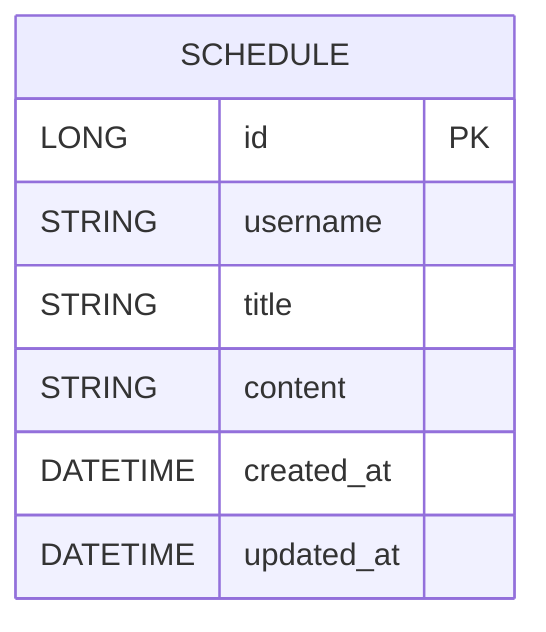

# 📅 일정 CRUD API 명세 (Schedule API)

본 문서는 Schedule API 명세서입니다.

---

##  공통 사항

- **도메인**: schedule
- **Base URL**: /schedules
- **리소스**: 일정(Schedule)
- **Auditing**
  - createdAt (작성일)
  - updatedAt (수정일)
  - JPA Auditing 자동 처리

---

##  Schedule 공통 필드

| 필드명 | 타입 | 설명 |
|------|------|------|
| id | Long | 일정 ID |
| username | String | 작성 유저명 |
| title | String | 할일 제목 |
| content | String | 할일 내용 |
| createdAt | LocalDateTime | 작성일 (자동 생성) |
| updatedAt | LocalDateTime | 수정일 (자동 갱신) |

---

## 1️. 일정 생성 API

**POST /schedules**

### Request Body
```json
{
  "username": "godi5",
  "title": "일정 생성",
  "content": "schedule API 만들기"
}
```

### Response (201 Created)
```json
{
  "id": 1,
  "username": "godi5",
  "title": "일정 생성",
  "content": "schedule API 만들기",
  "createdAt": "2026-04-17T10:30:00",
  "updatedAt": "2026-04-17T10:30:00"
}
```

---

## 2️. 일정 전체 조회 API

**GET /schedules**

### Response (200 OK)
```json
{
  "data": [
    {
      "id": 1,
      "username": "godi5",
      "title": "일정 생성",
      "content": "schedule API 만들기",
      "createdAt": "2026-04-17T10:30:00",
      "updatedAt": "2026-04-17T10:30:00"
    }
  ]
}
```

---

## 3️. 일정 단건 조회 API

**GET /schedules/{id}**

### Response (200 OK)
```json
{
  "id": 1,
  "username": "godi5",
  "title": "일정 생성",
  "content": "schedule API 만들기",
  "createdAt": "2026-04-17T10:30:00",
  "updatedAt": "2026-04-17T10:40:00"
}
```

---

## 4️. 일정 수정 API

**PUT /schedules/{id}**

### Request Body
```json
{
  "title": "일정 수정",
  "content": "CRUD 완성"
}
```

### Response (200 OK)
```json
{
  "id": 1,
  "username": "godi5",
  "title": "일정 수정",
  "content": "CRUD 완성",
  "createdAt": "2026-04-17T10:30:00",
  "updatedAt": "2026-04-17T10:45:00"
}
```

---

## 5️. 일정 삭제 API

**DELETE /schedules/{id}**

### Response (200 OK)
```json
{
  "message": "일정이 삭제되었습니다."
}
```


---

## 🗂️ ERD (Entity Relationship Diagram)



---

##  Lv1 요구사항 충족 체크

- 일정 생성 / 조회 / 수정 / 삭제 (CRUD)
- JPA Auditing으로 작성일·수정일 자동 관리
- 비밀번호 등 민감 정보는 환경변수로 관리
