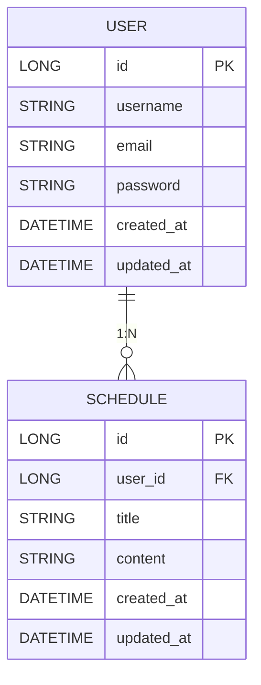

# 📅 일정 관리 API 명세 (Schedule API)

본 문서는 Schedule & User API 명세서입니다.

---

## 공통 사항

- **Schedule Base URL**: `http://localhost:8080/schedules`
- **User Base URL**: `http://localhost:8080/users`
- **Auditing**
  - createdAt (작성일) - JPA Auditing 자동 처리
  - updatedAt (수정일) - JPA Auditing 자동 처리

---

## 📋 테이블 명세

### USER 테이블

| 컬럼명 | 타입 | 제약조건 | 설명 |
|------|------|------|------|
| id | BIGINT | PK, AUTO_INCREMENT | 유저 고유 식별자 |
| username | VARCHAR(255) | NOT NULL | 유저명 |
| email | VARCHAR(255) | NOT NULL | 이메일 |
| password | VARCHAR(255) | NOT NULL | 비밀번호 (8글자 이상) |
| created_at | DATETIME | NOT NULL | 작성일 (자동 생성) |
| updated_at | DATETIME | NOT NULL | 수정일 (자동 갱신) |

### SCHEDULE 테이블

| 컬럼명 | 타입 | 제약조건 | 설명 |
|------|------|------|------|
| id | BIGINT | PK, AUTO_INCREMENT | 일정 고유 식별자 |
| user_id | BIGINT | FK, NOT NULL | 유저 고유 식별자 (users.id 참조) |
| title | VARCHAR(255) | NOT NULL | 할일 제목 |
| content | VARCHAR(255) | NOT NULL | 할일 내용 |
| created_at | DATETIME | NOT NULL | 작성일 (자동 생성) |
| updated_at | DATETIME | NOT NULL | 수정일 (자동 갱신) |

---

## 🗂️ ERD (Entity Relationship Diagram)



---

## 👤 User API

### User 공통 필드

| 필드명 | 타입 | 설명 |
|------|------|------|
| id | Long | 유저 ID |
| username | String | 유저명 |
| email | String | 이메일 |
| password | String | 비밀번호 (8글자 이상) |
| createdAt | LocalDateTime | 작성일 (자동 생성) |
| updatedAt | LocalDateTime | 수정일 (자동 갱신) |

---

### 1. 유저 생성 API

**POST /users**

#### Request Body
```json
{
  "username": "godi5",
  "email": "godi5@email.com"
}
```

#### Response (201 Created)
```json
{
  "id": 1,
  "username": "godi5",
  "email": "godi5@email.com",
  "createdAt": "2026-04-17T10:30:00",
  "updatedAt": "2026-04-17T10:30:00"
}
```

---

### 2. 유저 전체 조회 API

**GET /users**

#### Response (200 OK)
```json
[
  {
    "id": 1,
    "username": "godi5",
    "email": "godi5@email.com",
    "createdAt": "2026-04-17T10:30:00",
    "updatedAt": "2026-04-17T10:30:00"
  }
]
```

---

### 3. 유저 단건 조회 API

**GET /users/{id}**

#### Response (200 OK)
```json
{
  "id": 1,
  "username": "godi5",
  "email": "godi5@email.com",
  "createdAt": "2026-04-17T10:30:00",
  "updatedAt": "2026-04-17T10:30:00"
}
```

---

### 4. 유저 수정 API

**PATCH /users/{id}**

#### Request Body
```json
{
  "username": "godi5_수정",
  "email": "godi5_new@email.com"
}
```

#### Response (200 OK)
```json
{
  "id": 1,
  "username": "godi5_수정",
  "email": "godi5_new@email.com",
  "createdAt": "2026-04-17T10:30:00",
  "updatedAt": "2026-04-17T10:45:00"
}
```

---

### 5. 유저 삭제 API

**DELETE /users/{id}**

#### Response (200 OK)
```json
{
  "id": 1,
  "username": "godi5_수정",
  "email": "godi5_new@email.com",
  "createdAt": "2026-04-17T10:30:00",
  "updatedAt": "2026-04-17T10:45:00"
}
```

---

## 📅 Schedule API

### Schedule 공통 필드

| 필드명 | 타입 | 설명 |
|------|------|------|
| id | Long | 일정 ID |
| userId | Long | 유저 ID (FK) |
| title | String | 할일 제목 |
| content | String | 할일 내용 |
| createdAt | LocalDateTime | 작성일 (자동 생성) |
| updatedAt | LocalDateTime | 수정일 (자동 갱신) |

---

### 1. 일정 생성 API

**POST /schedules**

#### Request Body
```json
{
  "userId": 1,
  "title": "일정 생성",
  "content": "schedule API 만들기"
}
```

#### Response (201 Created)
```json
{
  "id": 1,
  "userId": 1,
  "title": "일정 생성",
  "content": "schedule API 만들기",
  "createdAt": "2026-04-17T10:30:00",
  "updatedAt": "2026-04-17T10:30:00"
}
```

---

### 2. 일정 전체 조회 API

**GET /schedules**

#### Response (200 OK)
```json
[
  {
    "id": 1,
    "userId": 1,
    "title": "일정 생성",
    "content": "schedule API 만들기",
    "createdAt": "2026-04-17T10:30:00",
    "updatedAt": "2026-04-17T10:30:00"
  }
]
```

---

### 3. 일정 단건 조회 API

**GET /schedules/{id}**

#### Response (200 OK)
```json
{
  "id": 1,
  "userId": 1,
  "title": "일정 생성",
  "content": "schedule API 만들기",
  "createdAt": "2026-04-17T10:30:00",
  "updatedAt": "2026-04-17T10:40:00"
}
```

---

### 4. 일정 수정 API

**PATCH /schedules/{id}**

#### Request Body
```json
{
  "title": "일정 수정",
  "content": "CRUD 완성"
}
```

#### Response (200 OK)
```json
{
  "id": 1,
  "userId": 1,
  "title": "일정 수정",
  "content": "CRUD 완성",
  "createdAt": "2026-04-17T10:30:00",
  "updatedAt": "2026-04-17T10:45:00"
}
```

---

### 5. 일정 삭제 API

**DELETE /schedules/{id}**

#### Response (200 OK)
```json
{
  "id": 1,
  "userId": 1,
  "title": "일정 수정",
  "content": "CRUD 완성",
  "createdAt": "2026-04-17T10:30:00",
  "updatedAt": "2026-04-17T10:45:00"
}
```

---

## ✅ 요구사항 충족 체크

### Lv1
- [x] 일정 생성 / 조회 / 수정 / 삭제 (CRUD)
- [x] JPA Auditing으로 작성일·수정일 자동 관리

### Lv2
- [x] 유저 생성 / 조회 / 수정 / 삭제 (CRUD)
- [x] JPA Auditing으로 작성일·수정일 자동 관리
- [x] 일정과 유저 연관관계 구현 (1:N)

### Lv3
- [x] 유저 비밀번호 필드 추가
- [x] 비밀번호 8글자 이상 검증
